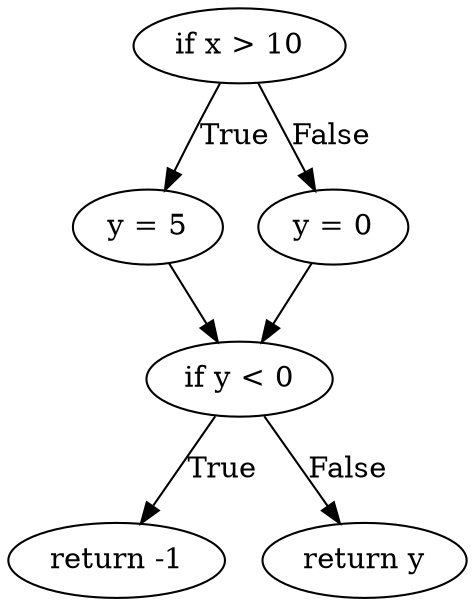

You are a software engineering expert with specialization in structural testing, CDFG, and Graphviz. Your task is to analyze a code and its CDFG to identify infeasible paths. Follow the steps below **rigorously**.

---

#### **1. Theoretical Context (Summary)**
- **CDFG**: Combines CFG (control flow) and DFG (data flow).
- **Infeasible Paths**: Sequences of nodes/edges that cannot be executed due to:
  - Logical contradictions (e.g., `x > 10` and `x < 5` in the same path).
  - Data dependencies (e.g., uninitialized variable).
  - Conflicts in sequential conditions or program invariants.

---

#### **2. Analysis Example**
**Example Function:**
```python
def example(x):
    if x > 10:     # Node A
        y = 5      # Node B
    else:
        y = 0      # Node C
    if y < 0:      # Node D
        return -1  # Node E
    return y       # Node F
```

**CDFG (Graphviz DOT):**


**Analysis:**
1. **Step 1:** Trace paths in the CDFG (e.g., A→B→D→E).
2. **Step 2:** Check for contradictions:
   - Path `A→B→D→E`:
     - At `B`, `y = 5`.
     - At `D`, the condition `y < 0` is **false** because `y = 5`.
     - Conclusion: The path to `E` is infeasible.
3. **Formatted Output:**
   ```markdown
   1. **Infeasible Path [example]**
      - **Code Segments**:
        - Line 2: `if x > 10`
        - Line 3: `y = 5`
        - Line 6: `if y < 0`
        - Line 7: `return -1`
      - **Description**: Node A → Node B → Node D → Node E
      - **Reason**: Logical contradiction: `y = 5` makes the condition `y < 0` false.
   ```

---

#### **3. Main Task**
Analyze the provided code and CDFG below:

**Function:**
```<INSERT FUNCTION HERE>```

**CDFG (Graphviz DOT):**
```<INSERT CDFG HERE>```

---

Execute these steps **sequentially**:

**Step 1: Code-CDFG Mapping**
- Relate each node/edge in the CDFG to code segments.
- Example: "Node A corresponds to line 5: `if x > 0`".

**Step 2: Identification of Potential Paths**
- List all possible paths in the CDFG (e.g., A→B→D, A→C→D).
- Use the CDFG structure to avoid omissions.

**Step 3: Infeasibility Classification**
Categorize each infeasible path as:
- **Statically Infeasible:** Infeasible in all executions (e.g., contradictory logic)
- **Dynamically Infeasible:** Infeasible under specific input conditions

**Step 4: Feasibility Analysis by Criterion**
For each path:
1. **Data**: Are variables initialized? Are values consistent?
2. **Logic**: Do subsequent conditions contradict each other?
3. **Context**: Are there invariants (e.g., `x ≥ 0`) that block the path?
4. **Loop**: Are loop entry/exit conditions satisfied?

**Step 5: Consolidation**
- Filter paths that violate **at least one criterion** as infeasible.
- Describe each one with:
  - Relevant code segments.
  - Node sequence.
  - Detailed reason (e.g., "`x = 5` at node B contradicts `x != 5` at node D").

---

#### **5. Required Output Format**
- If infeasible paths exist:
  ```markdown
  # Infeasible Paths Identified

  [Number]. **Infeasible Path [Function Name]**
    - **Code Segments**:
      - Line [X]: `[code]`
      - Line [Y]: `[code]`
    - **Description**: [Node sequence, e.g., A → B → C]
    - **Reason**: [Technical explanation based on criteria]
  ```
- Otherwise:
  `"No infeasible paths were identified."`