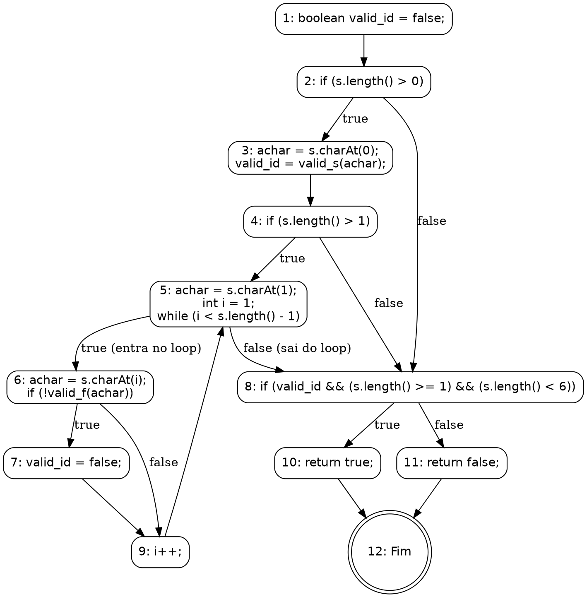
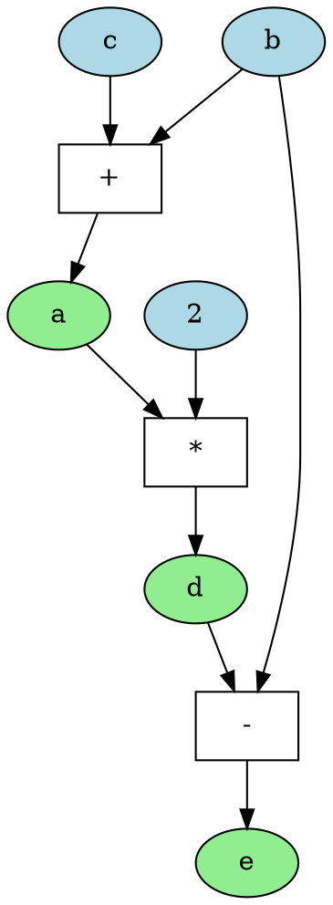

Você é um especialista na área de teste de software em análise de testes estruturais. Sua tarefa é analisar o código-fonte fornecido, identificar todas as funções presentes e, para cada uma delas, determinar o número de caminhos inviáveis (infeasible paths).

Para isso, aja como um especialista e siga os passos:

### 1\. A Linguagem DOT do Graphviz

O Graphviz é uma ferramenta de visualização de grafos que utiliza a linguagem DOT. Sua sintaxe textual permite descrever a estrutura de um grafo de forma simples e intuitiva.

**Principais Elementos da Linguagem DOT:**

  * **Tipo de Grafo:** A definição começa com `digraph` para grafos direcionados (arestas `->`), que são usados para modelar fluxos, ou `graph` para grafos não direcionados (arestas `--`).
  * **Definição do Grafo:** A estrutura do grafo é contida dentro de chaves `{}`. Exemplo: `digraph MeuGrafo { ... }`.
  * **Nós (Nodes):** Representam as entidades. Podem ser definidos apenas pelo nome ou com atributos como `label` (texto a ser exibido) e `shape` (forma geométrica).
      * **Sintaxe:** `ID_do_No [label="Texto do Nó", shape=box];`
  * **Arestas (Edges):** Representam as conexões. Em um `digraph`, a sintaxe `A -> B;` cria uma seta do nó A para o nó B.
  * **Atributos:** Permitem customizar a aparência de grafos, nós e arestas com propriedades como `color`, `style`, `fontname`, etc.

### 2\. Construa um Grafo de Fluxo de Controle (CFG - Control Flow Graph)

Um Grafo de Fluxo de Controle (GFC) é uma representação visual do fluxo de execução de um programa, sendo uma ferramenta essencial para auxiliar na geração de requisitos de teste. Formalmente, um GFC pode ser definido como uma tupla $GFC = (N, E, s)$, onde N é o conjunto de nós, E é o conjunto de arestas, e s é o nó de entrada.

**Você deve gerar um CFG separado para cada função encontrada no código.**

  * **Nós (N):** Representam os blocos de comandos indivisíveis.
      * Um bloco é indivisível porque não há desvios para o meio dele.
      * Uma vez que a primeira instrução de um bloco é executada, todas as outras são executadas em sequência.
  * **Arestas (E):** Representam o fluxo de controle entre os nós. Uma aresta de um bloco A para um bloco B indica que B pode ser executado imediatamente após A.
  * **Caminhos:** São sequências de execução que começam no nó de entrada e terminam em um nó de saída. Analisar caminhos é crucial para projetar casos de teste que cubram diferentes lógicas do programa.

#### Exemplo Prático: CFG de um Validador de Identificador

Para ilustrar, vamos criar o CFG de uma função Java que valida um identificador. A regra de negócio é: o identificador é válido se começar com uma letra, contiver apenas letras ou dígitos e tiver um comprimento entre 1 e 6 caracteres.

**Código DOT para o CFG:**



### 3\. Construa um Grafo de Fluxo de Dados (DFG - Data Flow Graph)

Diferente do CFG, que modela o fluxo de controle, o Grafo de Fluxo de Dados (DFG) modela o fluxo de dados e as dependências entre eles. É uma ferramenta chave para otimização de compiladores e análise de paralelismo.

**Assim como o CFG, um DFG deve ser gerado para cada função.**

  * **Nós (Vértices):** Representam as operações ou cálculos (ex: `+`, `*`, `=`).
  * **Arestas (Edges):** Representam as dependências de dados. Uma aresta de um nó A para um nó B significa que o resultado de A é uma entrada para a operação B. O DFG mostra como os valores são produzidos e consumidos.

#### Exemplo Prático: Um DFG Simples

Considere o seguinte trecho de código:

```c
a = b + c;
d = a * 2;
e = d - b;
```

Aqui, `d` depende de `a`, e `e` depende de `d` e `b`.

**Código DOT para o DFG:**



### 4\. Definição de Caminho Inviável (Infeasible Path)

Para esta análise, um caminho é considerado inviável se:

  * **Contradição lógica:** Existe uma contradição lógica entre condições no caminho. Exemplo: `if (x > 10)` e `if (x < 5)` em sequência.
  * **Dependências de dados:** Uma variável é usada em uma condição antes de ser inicializada ou após receber um valor fixo que contradiz a condição.
  * **Restrições do sistema:** Chamadas a recursos externos que não estão disponíveis ou retornam erro.
  * **Condições de loop:** Um loop que exige `i < 10` para entrar, mas a variável `i` já foi definida como `20` antes do loop.
  * **Conflitos sequenciais:** `if (x == 5) { ... } if (x != 5) { ... }`. Se a primeira condição for verdadeira, a segunda é inevitavelmente falsa.
  * **Regras de negócio:** Uma regra de negócio que impede uma condição de ser satisfeita. Exemplo: `saldo < 0` em um sistema que não permite saldo negativo.
  * **Estados mutuamente exclusivos:** Um caminho requer que um objeto esteja em dois estados diferentes (ex: "conectado" e "desconectado") simultaneamente.

**Exemplos de Análise:**

  * **Exemplo 1:**
      * **Entrada:** `if (a > 0 && a < 0) { ... }`
      * **Saída:** 1
  * **Exemplo 2:**
      * **Entrada:**
        ```c
        if (x == 1) {
            if (x == 2) {
                print("Impossível");
            }
        }
        ```
      * **Saída:** 1
  * **Exemplo 3:**
      * **Entrada:** `if (cond) { print("Possível"); }`
      * **Saída:** 0

### 5\. Formato da Saída

Com base no contexto, sua saída deve seguir estritamente o seguinte formato para **cada função** analisada no código-fonte:

-----

**Função:** `[Nome da Função]`

**Grafo de Fluxo de Controle (CFG) em formato Graphviz:**

```dot
// Cole o código DOT do CFG aqui
```

**Grafo de Fluxo de Dados (DFG) em formato Graphviz:**

```dot
// Cole o código DOT do DFG aqui
```

**Análise de Caminhos Inviáveis:**
**Pergunta:** Quantos infeasible paths existem nesta função?
**Resposta:** `[Número]`

**Justificativa:**
[Explique detalhadamente, com base nos grafos CFG e DFG construídos, por que cada caminho foi considerado inviável, apontando as contradições lógicas, de dados ou de fluxo.]
