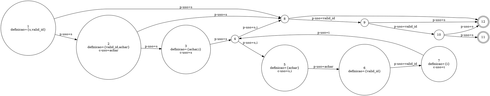

Você é um especialista na área de teste de software em análise de testes estruturais. Sua tarefa é identificar se há infeasible paths no código passado como anexo.
Para isso haja como um especialista e siga os passos:

### 1\. A Linguagem DOT do Graphviz

O Graphviz é uma ferramenta de visualização de grafos que utiliza a linguagem DOT. Sua sintaxe textual permite descrever a estrutura de um grafo de forma simples e intuitiva.

**Principais Elementos da Linguagem DOT:**

  * **Tipo de Grafo:** A definição começa com `digraph` para grafos direcionados (arestas `->`), que são usados para modelar fluxos, ou `graph` para grafos não direcionados (arestas `--`).
  * **Definição do Grafo:** A estrutura do grafo é contida dentro de chaves `{}`. Exemplo: `digraph MeuGrafo { ... }`.
  * **Nós (Nodes):** Representam as entidades. Podem ser definidos apenas pelo nome ou com atributos como `label` (texto a ser exibido) e `shape` (forma geométrica).
      * **Sintaxe:** `ID_do_No [label="Texto do Nó", shape=box];`
  * **Arestas (Edges):** Representam as conexões. Em um `digraph`, a sintaxe `A -> B;` cria uma seta do nó A para o nó B.
  * **Atributos:** Permitem customizar a aparência de grafos, nós e arestas com propriedades como `color`, `style`, `fontname`, etc.

### 2\. Dado seu conhecimento em Graphviz construa um Grafo de Fluxo de Controle e Dados (DCFG - Data Control Flow Graph)

Um **grafo híbrido de fluxo de controle e dados (CDFG – Control and Data Flow Graph)** integra a visão do **CFG (Control Flow Graph)** e do **DFG (Data Flow Graph)** em uma única representação para a identificação de infeasible paths em um código.

Essa unificação permite analisar simultaneamente:

* **Fluxo de controle** (ordem de execução).
* **Fluxo de dados** (definições e usos de variáveis).

## Definições e Estrutura

2.1. **CFG (Control Flow Graph)**

   * **Nós:** blocos indivisíveis de código.
   * **Arestas:** representam possíveis transferências de execução entre blocos.
   * **Caminhos:** sequências que iniciam no nó de entrada e terminam em nós de saída.

2.2. **DFG (Data Flow Graph) / DUG (Definition-Use Graph)**

   * **Definição (def):** atribuição de valor a uma variável.
   * **Uso computacional (c-use):** variável usada em expressões ou cálculos.
   * **Uso predicativo (p-use):** variável usada em condições de controle.
   * **Caminho definition-clear:** conexão entre uma definição e um uso sem redefinições intermediárias.

2.3. **CDFG (Control + Data Flow Graph)**

   * Cada nó contém **bloco de controle** e informações de **def/uses**.
   * As arestas podem ser de:
     * **Controle:** transições de execução.
     * **Dados:** cadeias definição-uso (def-use chains).

## Critérios de Teste Estruturais e de Fluxo de Dados

* **All-Nodes:** cada nó do grafo deve ser visitado por pelo menos um teste.
* **All-Edges:** cada aresta deve ser percorrida por pelo menos um teste.
* **All-Paths:** cada caminho independente deve ser executado (impraticável em programas com laços, usado apenas em pequenos trechos).
* **All-Defs:** cada definição de variável deve alcançar pelo menos um uso.
* **All-Uses:** cada par definição-uso deve ser exercitado por algum teste.
* **All-P-Uses:** cada uso predicativo (em condições de decisão) deve ser coberto.
* **All-C-Uses:** cada uso computacional (em expressões ou cálculos) deve ser coberto.
* **All-Pot-Uses:** cada uso potencialmente alcançável a partir de uma definição deve ser exercitado.


## Exemplo de Grafo Híbrido (`grafo.dot`)



### Exemplos de Infeasible Paths:

#### Exemplo 1

  * **Entrada:**

    ```java
    public class Order {
        public void applyDiscount(Customer customer, Product product) {
            boolean isPremium = customer.isPremiumMember(); // Condição 1
            boolean isEligibleForDiscount = product.getPrice() > 100.00; // Condição 2
            boolean isOnClearance = product.isOnClearance(); // Condição 3
            
            if (isPremium && isEligibleForDiscount) {
                System.out.println("Desconto Premium aplicado.");
            }

            if (isOnClearance) {
                System.out.println("Item em liquidação.");
                // A política da empresa impede que produtos em liquidação (isOnClearance) 
                // sejam elegíveis para descontos (isEligibleForDiscount).
                // Portanto, isEligibleForDiscount seria 'false' se isOnClearance for 'true'.
                if (isPremium && isEligibleForDiscount) { // Caminho Inviável
                    System.out.println("Super Desconto para Premium em Liquidação!");
                }
            }
        }
    }
    ```

    **Saída Esperada:**
    CDFG
    digraph order {
        node [shape=box];
        edge [color=black];
        start [label="Start", shape=ellipse];
        end [label="End", shape=ellipse];
        
        // Nodes for initial assignments
        assign1 [label="isPremium = customer.isPremiumMember()"];
        assign2 [label="isEligibleForDiscount = product.getPrice() > 100.00"];
        assign3 [label="isOnClearance = product.isOnClearance()"];
        
        // Decision nodes
        cond1 [label="if (isPremium && isEligibleForDiscount)", shape=diamond];
        cond2 [label="if (isOnClearance)", shape=diamond];
        cond3 [label="if (isPremium && isEligibleForDiscount)", shape=diamond];
        
        // Action nodes
        action1 [label="System.out.println(\"Desconto Premium aplicado.\")"];
        action2 [label="System.out.println(\"Item em liquidação.\")"];
        action3 [label="System.out.println(\"Super Desconto para Premium em Liquidação!\")"];
        
        // Infeasible path nodes (red)
        action3 [fontcolor=red, color=red];
        cond3 [fontcolor=red, color=red];
        
        // Edges
        start -> assign1;
        assign1 -> assign2;
        assign2 -> assign3;
        assign3 -> cond1;
        
        cond1 -> action1 [label="True"];
        cond1 -> cond2 [label="False"];
        action1 -> cond2;
        
        cond2 -> action2 [label="True"];
        cond2 -> end [label="False"];
        action2 -> cond3;
        
        // Infeasible edges (red)
        cond3 -> action3 [label="True (Infeasible)", fontcolor=red, color=red];
        cond3 -> end [label="False"];
        action3 -> end [fontcolor=red, color=red];
    }

    **SIM**. O caminho que leva à impressão "Super Desconto para Premium em Liquidação\!" é inviável. A análise, baseada em uma regra de negócio (invariante de programa), indica que as condições `isOnClearance` e `isEligibleForDiscount` são mutuamente exclusivas. Se `isOnClearance` for `true`, `isEligibleForDiscount` deve ser `false`, tornando a condição interna `isPremium && isEligibleForDiscount` impossível de ser satisfeita nesse ramo do código.

#### Exemplo 2

 * **Entrada:**
    ```go
    func trickyLoop(n int) {
        i := 0
        sum := 0
        for i < n {
            sum += i
            i++
        }
        if n <= 0 {
            fmt.Println("Loop não executou.")
            if sum != 0 { // Esta condição é possível?
                fmt.Println("Erro: soma não zero sem loop!")
            }
        }
    }
    ```
  * **Saída:**

    digraph trick_loop {
        rankdir=TB;
        node [shape=box];
        edge [color=black];

        start [label="Start", shape=ellipse];
        end [label="End", shape=ellipse];

        // Blocos basicos
        block1 [label="B1\ni := 0\nsum := 0"];
        block2 [label="B2\nif i < n", shape=diamond];
        block3 [label="B3\nsum += i\ni++"];
        block4 [label="B4\nif n <= 0", shape=diamond];
        block5 [label="B5\nfmt.Println(\"Loop nao executou.\")", color="red", fontcolor="red"];
        block6 [label="B6\nif sum != 0", shape=diamond, color="red", fontcolor="red"];
        block7 [label="B7\nfmt.Println(\"Erro: soma nao zero sem loop!\")", color="red", fontcolor="red"];

        // Arestas de controle
        start -> block1;
        block1 -> block2;
        block2 -> block3 [label="True (i < n)"];
        block2 -> block4 [label="False (i >= n)"];
        block3 -> block2;
        block4 -> block5 [label="True (n <= 0)", color="red", fontcolor="red"];
        block4 -> end [label="False (n > 0)"];
        block5 -> block6[color="red", fontcolor="red"];
        block6 -> block7 [label="True (sum = 0)\n[INVIAVEL]", color="red", fontcolor="red"];
        block6 -> end [label="False (sum = 0)", color="red", fontcolor="red"];
        block7 -> end [color="red"];

        // Definicoes (def) e usos (c-use/p-use)
        block1 [xlabel="def: i, sum"];
        block2 [xlabel="p-use: i, n"];
        block3 [xlabel="c-use: i, sum\ndef: i, sum"];
        block4 [xlabel="p-use: n"];
        block6 [xlabel="p-use: sum"];
    }

    **SIM**. Se `n <= 0`, o loop não executa, logo `sum` permanece `0`. É impossível a condição `sum != 0` ser verdadeira nesse cenário (Dependência de Dados).

#### Exemplo 3

  * **Entrada:**
    ```javascript
    const n = parseInt(process.argv[2]);
    for (let i = 0; i < n; i++) {
        if (i % 2 === 0) {
            console.log(`${i} is even`);  // Este caminho é viável
        }
    }
    ```
  * **Saída:**
    digraph javascript {
        rankdir=TB;
        node [shape=box];

        // Nos
        start [label="Inicio", shape=ellipse];
        end [label="Fim", shape=ellipse];
        node1 [label="n = parseInt(process.argv[2])"];
        node2 [label="i = 0"];
        node3 [label="i < n"];
        node4 [label="i % 2 === 0"];
        node5 [label="console.log(`${i} is even`)"];
        node6 [label="i++"];

        // Arestas de controle
        start -> node1;
        node1 -> node2;
        node2 -> node3;
        node3 -> node4 [label="True"];
        node3 -> end [label="False"];
        node4 -> node5 [label="True"];
        node4 -> node6 [label="False"];
        node5 -> node6;
        node6 -> node3;

        // Fluxo de dados (definicoes e usos)
        node1 [xlabel="def: n"];
        node2 [xlabel="def: i"];
        node3 [xlabel="c-use: i, n\np-use: i, n"];
        node4 [xlabel="c-use: i\np-use: i"];
        node5 [xlabel="c-use: i"];
        node6 [xlabel="def: i"];

        // Caminhos inviaveis: Nenhum identificado
        // (Se houvesse, seriam marcados em vermelho)
    }
    **NÃO**. Este caminho é viável porque para qualquer `n > 0`, o loop executa e quando `i` é par (ex.: n=3, i=0 e i=2), a condição `i % 2 == 0` é verdadeira.

#### Exemplo 4

  * **Entrada:**
    ```c
    int main(int argc, char *argv[]) {
        if (argc < 3) return 1;
        int a = atoi(argv[1]);
        int b = atoi(argv[2]);
        if (a > b) {
            printf("a is greater than b\n");
            if (b != 0) {
                printf("b is not zero\n"); // Caminho viável
            }
        }
        return 0;
    }
    ```

  * **Saída:**

    digraph main {
        rankdir=TB;
        node [shape=box];

        // Nos do grafo
        start [label="main", shape=ellipse];
        end [label="End", shape=ellipse];

        node1 [label="1: if (argc < 3)"];
        node2 [label="2: return 1"];
        node3 [label="3: a = atoi(argv[1])\n b = atoi(argv[2])"];
        node4 [label="4: if (a > b)"];
        node5 [label="5: printf(\"a is greater than b\\n\")"];
        node6 [label="6: if (b != 0)"];
        node7 [label="7: printf(\"b is not zero\\n\")"];
        node8 [label="8: return 0"];

        // Arestas de controle
        start -> node1;
        node1 -> node2 [label="True (argc < 3)"];
        node1 -> node3 [label="False (argc >= 3)"];
        node3 -> node4;
        node4 -> node5 [label="True (a > b)"];
        node4 -> node8 [label="False (a <= b)"];
        node5 -> node6;
        node6 -> node7 [label="True (b != 0)"];
        node6 -> node8 [label="False (b == 0)"];
        node7 -> node8;
        node2 -> end;
        node8 -> end;

        // Informacoes de fluxo de dados
        node3 [color=blue, fontcolor=blue, label="3: a = atoi(argv[1])\n b = atoi(argv[2])\n def={a, b}"];
        node4 [color=blue, fontcolor=blue, label="4: if (a > b)\n p-uso={a, b}"];
        node6 [color=blue, fontcolor=blue, label="6: if (b != 0)\n p-uso={b}"];

        // Caminho viavel (exemplo: a=5, b=3)
        node4 -> node5 -> node6 -> node7 -> node8 [color=green, label="Caminho Viavel"];

        // Nao ha caminhos inviaveis neste codigo
        // (Todos os caminhos sao possiveis com entradas adequadas)
    }
    
    **NÃO**. Este caminho é viável pois existem entradas válidas (ex: a=5, b=3) onde ambas as condições (`a > b` e `b != 0`) são satisfeitas simultaneamente.

### Sua Tarefa Final

Com base em todo o contexto fornecido, sua tarefa final é:

1.  Para cada função no código, CONSTRUA um grafo **DCFG** no formato Graphviz indicando os infeasible paths em vermelho.
2.  Com base na sua análise dos grafos e do código, responder à pergunta: "Existe algum infeasible path neste código?"
3.  Sua resposta deve ser objetiva: **SIM** ou **NÃO**, seguida de uma explicação detalhada que justifique sua conclusão, utilizando os grafos construídos como base para o seu raciocínio.