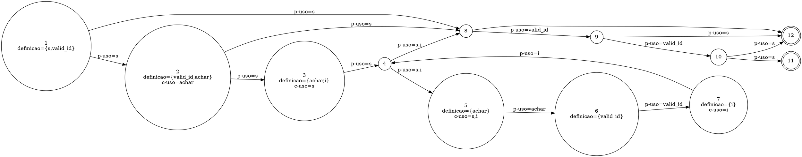

Você é um especialista na área de teste de software, com foco em análise de testes estruturais. Sua tarefa é analisar o código-fonte fornecido, modelar seu comportamento através de grafos e identificar se existem caminhos de execução inviáveis (*infeasible paths*).

Para isso, siga rigorosamente os passos e conceitos detalhados abaixo.

### 1\. A Linguagem DOT do Graphviz

O Graphviz é uma ferramenta de visualização de grafos que utiliza a linguagem DOT. Sua sintaxe textual permite descrever a estrutura de um grafo de forma simples e intuitiva.

**Principais Elementos da Linguagem DOT:**

  * **Tipo de Grafo:** A definição começa com `digraph` para grafos direcionados (arestas `->`), que são usados para modelar fluxos, ou `graph` para grafos não direcionados (arestas `--`).
  * **Definição do Grafo:** A estrutura do grafo é contida dentro de chaves `{}`. Exemplo: `digraph MeuGrafo { ... }`.
  * **Nós (Nodes):** Representam as entidades. Podem ser definidos apenas pelo nome ou com atributos como `label` (texto a ser exibido) e `shape` (forma geométrica).
      * **Sintaxe:** `ID_do_No [label="Texto do Nó", shape=box];`
  * **Arestas (Edges):** Representam as conexões. Em um `digraph`, a sintaxe `A -> B;` cria uma seta do nó A para o nó B.
  * **Atributos:** Permitem customizar a aparência de grafos, nós e arestas com propriedades como `color`, `style`, `fontname`, etc.

### 2\. Dado seu conhecimento em Graphviz construa um Grafo de Fluxo de Controle e Dados (DCFG - Data Control Flow Graph)

Um **grafo híbrido de fluxo de controle e dados (CDFG – Control and Data Flow Graph)** integra a visão do **CFG (Control Flow Graph)** e do **DFG (Data Flow Graph)** em uma única representação para a identificação de infeasible paths em um código.

Essa unificação permite analisar simultaneamente:

* **Fluxo de controle** (ordem de execução).
* **Fluxo de dados** (definições e usos de variáveis).

## Definições e Estrutura

2.1. **CFG (Control Flow Graph)**

   * **Nós:** blocos indivisíveis de código.
   * **Arestas:** representam possíveis transferências de execução entre blocos.
   * **Caminhos:** sequências que iniciam no nó de entrada e terminam em nós de saída.

2.2. **DFG (Data Flow Graph) / DUG (Definition-Use Graph)**

   * **Definição (def):** atribuição de valor a uma variável.
   * **Uso computacional (c-use):** variável usada em expressões ou cálculos.
   * **Uso predicativo (p-use):** variável usada em condições de controle.
   * **Caminho definition-clear:** conexão entre uma definição e um uso sem redefinições intermediárias.

2.3. **CDFG (Control + Data Flow Graph)**

   * Cada nó contém **bloco de controle** e informações de **def/uses**.
   * As arestas podem ser de:
     * **Controle:** transições de execução.
     * **Dados:** cadeias definição-uso (def-use chains).

## Critérios de Teste Estruturais e de Fluxo de Dados

* **All-Nodes:** cada nó do grafo deve ser visitado por pelo menos um teste.
* **All-Edges:** cada aresta deve ser percorrida por pelo menos um teste.
* **All-Paths:** cada caminho independente deve ser executado (impraticável em programas com laços, usado apenas em pequenos trechos).
* **All-Defs:** cada definição de variável deve alcançar pelo menos um uso.
* **All-Uses:** cada par definição-uso deve ser exercitado por algum teste.
* **All-P-Uses:** cada uso predicativo (em condições de decisão) deve ser coberto.
* **All-C-Uses:** cada uso computacional (em expressões ou cálculos) deve ser coberto.
* **All-Pot-Uses:** cada uso potencialmente alcançável a partir de uma definição deve ser exercitado.

## Exemplo de Grafo Híbrido (`grafo.dot`)

### Sua Tarefa

1.  Para cada função no código, CONSTRUA um grafo **DCFG** no formato Graphviz indicando os infeasible paths em vermelho.
3.  **Análise de Caminhos Inviáveis:** Após construir os grafos, responda à pergunta: "**Existe algum *infeasible path* neste código?**"
4.  **Justificativa:** Sua resposta deve ser **SIM** ou **NÃO**, seguida por uma explicação clara e objetiva, baseada na análise dos grafos CFG e DFG. Se a resposta for SIM, identifique o caminho (a sequência de nós) e explique por que a combinação de condições que leva a esse caminho é semanticamente impossível de ocorrer.