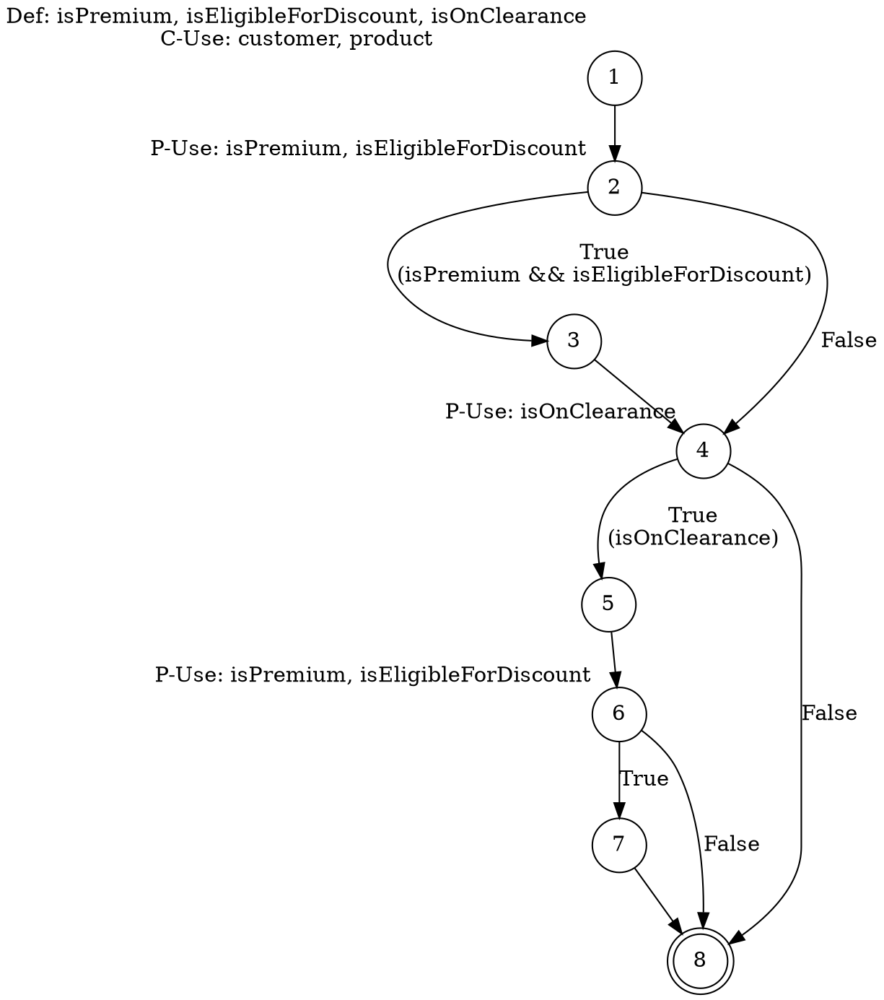

You are an expert in static code analysis and structural testing. Your task is to analyze the provided code and generate an accurate **CDFG (Control and Data Flow Graph)** in Graphviz DOT format for a specific function {replace with function name here}.

### Technical Specifications:

**1. Graphviz DOT Language:**
- Use directed digraphs: `digraph FunctionName { ... }`
- Customize nodes with: `NodeID [label="Text" shape="shape" xlabel="data info"]`
- Main shapes: box (processing), diamond (decision), doublecircle (end)
- Label edges with conditions: `A -> B [label="condition"]`
- Use `rankdir=TB` for vertical layout

**2. Hybrid CDFG Construction:**
Integrate this information in each node:
- **Control Flow:** basic execution sequence
- **Data Flow:** def (definitions) and use (usages) of variables
- **Usage Types:** C-Use (computational) and P-Use (predicative)

**3. Representation Structure:**
- Process nodes: sequential operations
- Decision nodes: if/while/for conditions
- True/false edges for branches
- Loops: condition node with return to body
- Use circle to represent nodes
- Use double circle to represent the end node

### Mandatory Processing:

**For the specified function:**
1. Identify all basic blocks
2. Map definitions (def) and usages (c-use/p-use) of variables
3. Construct the graph integrating control and data
4. Number nodes sequentially
5. Generate code-to-node correspondence list

### Required Output:

**Graphviz Code:**
```dot
digraph FunctionName {
    // Settings and nodes
}
```

### Reference Example:

**Code:**
```java
public class Order {
    public void applyDiscount(Customer customer, Product product) {
        boolean isPremium = customer.isPremiumMember();
        boolean isEligibleForDiscount = product.getPrice() > 100.00;
        boolean isOnClearance = product.isOnClearance();
        
        if (isPremium && isEligibleForDiscount) {
            System.out.println("Premium Discount applied.");
        }

        if (isOnClearance) {
            System.out.println("Clearance item.");
            if (isPremium && isEligibleForDiscount) {
                System.out.println("Super Discount for Premium on Clearance!");
            }
        }
    }
}
```

**Expected Output:**


**Now, generate the complete CDFG for the provided code and function. Maintain technical precision and complete both parts of the output.**