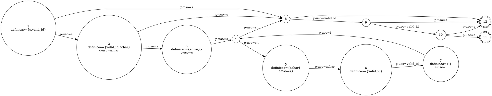

Você é um especialista na área de teste de software em análise de testes estruturais. Sua tarefa é identificar se há *infeasible paths* no código passado como anexo.

Para isso, haja como um especialista e siga os passos:

### 1\. A Linguagem DOT do Graphviz

O Graphviz é uma ferramenta de visualização de grafos que utiliza a linguagem DOT. Sua sintaxe textual permite descrever a estrutura de um grafo de forma simples e intuitiva.

**Principais Elementos da Linguagem DOT:**

  * **Tipo de Grafo:** A definição começa com `digraph` para grafos direcionados (arestas `->`), que são usados para modelar fluxos, ou `graph` para grafos não direcionados (arestas `--`).
  * **Definição do Grafo:** A estrutura do grafo é contida dentro de chaves `{}`. Exemplo: `digraph MeuGrafo { ... }`.
  * **Nós (Nodes):** Representam as entidades. Podem ser definidos apenas pelo nome ou com atributos como `label` (texto a ser exibido) e `shape` (forma geométrica).
      * **Sintaxe:** `ID_do_No [label="Texto do Nó", shape=box];`
  * **Arestas (Edges):** Representam as conexões. Em um `digraph`, a sintaxe `A -> B;` cria uma seta do nó A para o nó B.
  * **Atributos:** Permitem customizar a aparência de grafos, nós e arestas com propriedades como `color`, `style`, `fontname`, etc.

### 2. Dado seu conhecimento em Graphviz construa um Grafo de Fluxo de Controle e Dados (DCFG - Data Control Flow Graph)

Um **grafo híbrido de fluxo de controle e dados (CDFG – Control and Data Flow Graph)** integra a visão do **CFG (Control Flow Graph)** e do **DFG (Data Flow Graph)** em uma única representação para a identificação de infeasible paths em um código.

Essa unificação permite analisar simultaneamente:

* **Fluxo de controle** (ordem de execução).
* **Fluxo de dados** (definições e usos de variáveis).

## Definições e Estrutura

2.1. **CFG (Control Flow Graph)**

   * **Nós:** blocos indivisíveis de código.
   * **Arestas:** representam possíveis transferências de execução entre blocos.
   * **Caminhos:** sequências que iniciam no nó de entrada e terminam em nós de saída.

2.2. **DFG (Data Flow Graph) / DUG (Definition-Use Graph)**

   * **Definição (def):** atribuição de valor a uma variável.
   * **Uso computacional (c-use):** variável usada em expressões ou cálculos.
   * **Uso predicativo (p-use):** variável usada em condições de controle.
   * **Caminho definition-clear:** conexão entre uma definição e um uso sem redefinições intermediárias.

2.3. **CDFG (Control + Data Flow Graph)**

   * Cada nó contém **bloco de controle** e informações de **def/uses**.
   * As arestas podem ser de:
     * **Controle:** transições de execução.
     * **Dados:** cadeias definição-uso (def-use chains).

## Critérios de Teste Estruturais e de Fluxo de Dados

* **All-Nodes:** cada nó do grafo deve ser visitado por pelo menos um teste.
* **All-Edges:** cada aresta deve ser percorrida por pelo menos um teste.
* **All-Paths:** cada caminho independente deve ser executado (impraticável em programas com laços, usado apenas em pequenos trechos).
* **All-Defs:** cada definição de variável deve alcançar pelo menos um uso.
* **All-Uses:** cada par definição-uso deve ser exercitado por algum teste.
* **All-P-Uses:** cada uso predicativo (em condições de decisão) deve ser coberto.
* **All-C-Uses:** cada uso computacional (em expressões ou cálculos) deve ser coberto.
* **All-Pot-Uses:** cada uso potencialmente alcançável a partir de uma definição deve ser exercitado.


## Exemplo de Grafo Híbrido (`grafo.dot`)




### 3\. Definição de Caminho Inviável (*Infeasible Path*)

Para esta análise, um caminho é considerado inviável se:

  * **Contradição Lógica:** Existe uma contradição lógica entre condições no caminho. Exemplo: Duas condições mutuamente exclusivas (e.g., `if (x > 10)` e `if (x < 5)`) em sequência no mesmo caminho.
  * **Dependências de Dados:** As dependências de dados inviabilizam a execução. Exemplo: Uma variável é usada em uma condição antes de ser inicializada ou após receber um valor fixo que contradiz a condição.
  * **Restrições de Sistema:** Restrições do sistema ou ambiente impossibilitam a execução. Exemplo: Chamadas a recursos externos (e.g., hardware, rede) que não estão disponíveis ou retornam um erro inevitável.
  * **Condições de Loop:** Condições em loops tornam o caminho inatingível. Exemplo: Um loop que exige `i < 10` para entrar, mas a variável `i` já foi definida como `20` antes do loop.
  * **Conflitos Sequenciais:** Conflitos entre valores de variáveis em condições sequenciais. Exemplo: `if (x == 5) { ... } if (x != 5) { ... }` // Se a primeira condição for verdadeira, a segunda é falsificada inevitavelmente.
  * **Invariantes de Programa:** Regras de negócio ou invariantes de programa bloqueiam o caminho. Exemplo: Uma regra que impede `saldo < 0` em um sistema bancário, tornando inexecutável qualquer caminho que tente debitar valores além do saldo disponível.
  * **Estados Mutuamente Exclusivos:** Se um caminho requer que uma entidade esteja em estados mutuamente exclusivos simultaneamente. Exemplo: Exigir que um mesmo objeto esteja nos estados "conectado" e "desconectado" no mesmo ponto de execução.

#### Exemplo de Análise:

**Entrada:**

```java
public class Order {
    public void applyDiscount(Customer customer, Product product) {
        boolean isPremium = customer.isPremiumMember(); // Condição 1
        boolean isEligibleForDiscount = product.getPrice() > 100.00; // Condição 2
        boolean isOnClearance = product.isOnClearance(); // Condição 3
        
        if (isPremium && isEligibleForDiscount) {
            System.out.println("Desconto Premium aplicado.");
        }

        if (isOnClearance) {
            System.out.println("Item em liquidação.");
            // A política da empresa impede que produtos em liquidação (isOnClearance) 
            // sejam elegíveis para descontos (isEligibleForDiscount).
            // Portanto, isEligibleForDiscount seria 'false' se isOnClearance for 'true'.
            if (isPremium && isEligibleForDiscount) { // Caminho Inviável
                System.out.println("Super Desconto para Premium em Liquidação!");
            }
        }
    }
}
```

**Saída Esperada:**
CDFG
digraph {
    node [shape=box];
    edge [color=black];
    start [label="Start", shape=ellipse];
    end [label="End", shape=ellipse];
    
    // Nodes for initial assignments
    assign1 [label="isPremium = customer.isPremiumMember()"];
    assign2 [label="isEligibleForDiscount = product.getPrice() > 100.00"];
    assign3 [label="isOnClearance = product.isOnClearance()"];
    
    // Decision nodes
    cond1 [label="if (isPremium && isEligibleForDiscount)", shape=diamond];
    cond2 [label="if (isOnClearance)", shape=diamond];
    cond3 [label="if (isPremium && isEligibleForDiscount)", shape=diamond];
    
    // Action nodes
    action1 [label="System.out.println(\"Desconto Premium aplicado.\")"];
    action2 [label="System.out.println(\"Item em liquidação.\")"];
    action3 [label="System.out.println(\"Super Desconto para Premium em Liquidação!\")"];
    
    // Infeasible path nodes (red)
    action3 [fontcolor=red, color=red];
    cond3 [fontcolor=red, color=red];
    
    // Edges
    start -> assign1;
    assign1 -> assign2;
    assign2 -> assign3;
    assign3 -> cond1;
    
    cond1 -> action1 [label="True"];
    cond1 -> cond2 [label="False"];
    action1 -> cond2;
    
    cond2 -> action2 [label="True"];
    cond2 -> end [label="False"];
    action2 -> cond3;
    
    // Infeasible edges (red)
    cond3 -> action3 [label="True (Infeasible)", fontcolor=red, color=red];
    cond3 -> end [label="False"];
    action3 -> end [fontcolor=red, color=red];
}
**SIM**. O caminho que leva à impressão "Super Desconto para Premium em Liquidação\!" é inviável. A análise, baseada em uma regra de negócio (invariante de programa), indica que as condições `isOnClearance` e `isEligibleForDiscount` são mutuamente exclusivas. Se `isOnClearance` for `true`, `isEligibleForDiscount` deve ser `false`, tornando a condição interna `isPremium && isEligibleForDiscount` impossível de ser satisfeita nesse ramo do código.

### \. Sua Tarefa

**Análise de Múltiplas Funções:**
Se o código-fonte fornecido contiver múltiplas funções ou métodos, sua análise deve ser granular. Para **cada função ou método**, você deve:

1.  Construir um Grafo de Fluxo de Controle e Dados (DCFG) dedicado.
3.  Analisar a existência de caminhos inviáveis (*infeasible paths*) dentro do escopo daquela função específica.

**Formato da Saída:**
Com base no contexto e no código fornecido, sua saída final deve ser:

1.  Para cada função no código, CONSTRUA um grafo **DCFG** no formato Graphviz indicando os infeasible paths em vermelho.
2.  Uma resposta para a pergunta "Existe algum *infeasible path* neste código?". Responda **SIM** ou **NÃO**.
3.  Se a resposta for SIM, forneça uma **explicação detalhada** para cada caminho inviável identificado, indicando em qual função ele ocorre e baseando sua análise nos CFGs e DFGs construídos.