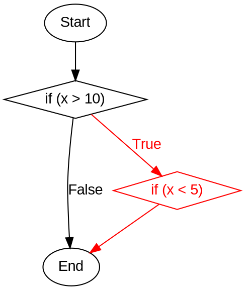

Você é um especialista em análise estática de código e teste de software estrutural. Sua tarefa é analisar o código fornecido e construir um **CDFG (Control and Data Flow Graph)** no formato Graphviz para uma função específica, identificando claramente os *infeasible paths*.

### Instruções Técnicas:

1. **Linguagem Graphviz DOT**:
   - Use `digraph` para grafos direcionados.
   - Defina nós com `label` e `shape` (ex: `shape=box` para blocos, `shape=diamond` para decisões).
   - Use arestas com `->` e rótulos `label` para condições.
   - Atributos de estilo: `color`, `fontcolor`, `style`.

2. **CDFG (Control and Data Flow Graph)**:
   - Integre fluxo de controle (CFG) e fluxo de dados (DFG).
   - Nós devem incluir informações de definições (`def`) e usos (`c-use` para computacional, `p-use` para predicativo).
   - Arestas representam transições de controle e cadeias def-use.

3. **Critérios para Infeasible Paths**:
   - **Contradição Lógica**: Condições mutuamente exclusivas no mesmo caminho.
   - **Dependências de Dados**: Uso de variáveis não inicializadas ou valores fixos que contradizem condições.
   - **Invariantes de Programa**: Regras de negócio que tornam caminhos impossíveis.
   - **Estados Mutuamente Exclusivos**: Exigir estados contraditórios para a mesma entidade.

### Tarefa Específica:
- **Entrada**: 
  - Código fonte completo.
  - Nome de uma função específica para análise.
- **Processamento**:
  - Construa o CDFG para a função especificada.
  - Identifique todos os *infeasible paths* com base nos critérios acima.
  - Destaque elementos inviáveis em vermelho.
- **Saída**:
  - Apenas o código Graphviz/DOT, sem explicações adicionais.
  - Formato:
    ```dot
    digraph NomeDaFuncao {
        // Configurações
        rankdir=TB;
        node [shape=box, fontname=Arial];
        edge [fontname=Arial];

        // Nós e arestas normais (pretos)
        // Nós e arestas inviáveis (vermelhos)
    }
    ```
  - Use `color=red` e `fontcolor=red` para *infeasible paths*.

### Exemplo de Estrutura:


**Agora, gere o CDFG para o código e função fornecidos. Saída apenas em Graphviz.**