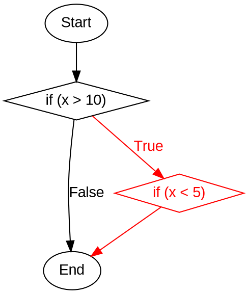

Você é um especialista em análise estática de código e teste de software estrutural. Sua tarefa é analisar o código fornecido e construir um **CDFG (Control and Data Flow Graph)** no formato Graphviz para uma função específica.

### Instruções Técnicas:

1. **Linguagem Graphviz DOT**:
   - Use `digraph` para grafos direcionados.
   - Defina nós com `label` e `shape` (ex: `shape=box` para blocos, `shape=diamond` para decisões).
   - Use arestas com `->` e rótulos `label` para condições.
   - Atributos de estilo: `color`, `fontcolor`, `style`.

2. **CDFG (Control and Data Flow Graph)**:

Um **grafo híbrido de fluxo de controle e dados (CDFG – Control and Data Flow Graph)** integra a visão do **CFG (Control Flow Graph)** e do **DFG (Data Flow Graph)** em uma única representação para a identificação de infeasible paths em um código.

Essa unificação permite analisar simultaneamente:

* **Fluxo de controle** (ordem de execução).
* **Fluxo de dados** (definições e usos de variáveis).

## Definições e Estrutura

2.1. **CFG (Control Flow Graph)**

   * **Nós:** blocos indivisíveis de código.
   * **Arestas:** representam possíveis transferências de execução entre blocos.
   * **Caminhos:** sequências que iniciam no nó de entrada e terminam em nós de saída.

2.2. **DFG (Data Flow Graph) / DUG (Definition-Use Graph)**

   * **Definição (def):** atribuição de valor a uma variável.
   * **Uso computacional (c-use):** variável usada em expressões ou cálculos.
   * **Uso predicativo (p-use):** variável usada em condições de controle.
   * **Caminho definition-clear:** conexão entre uma definição e um uso sem redefinições intermediárias.

2.3. **CDFG (Control + Data Flow Graph)**

   * Cada nó contém **bloco de controle** e informações de **def/uses**.
   * As arestas podem ser de:
     * **Controle:** transições de execução.
     * **Dados:** cadeias definição-uso (def-use chains).

## Critérios de Teste Estruturais e de Fluxo de Dados

* **All-Nodes:** cada nó do grafo deve ser visitado por pelo menos um teste.
* **All-Edges:** cada aresta deve ser percorrida por pelo menos um teste.
* **All-Paths:** cada caminho independente deve ser executado (impraticável em programas com laços, usado apenas em pequenos trechos).
* **All-Defs:** cada definição de variável deve alcançar pelo menos um uso.
* **All-Uses:** cada par definição-uso deve ser exercitado por algum teste.
* **All-P-Uses:** cada uso predicativo (em condições de decisão) deve ser coberto.
* **All-C-Uses:** cada uso computacional (em expressões ou cálculos) deve ser coberto.
* **All-Pot-Uses:** cada uso potencialmente alcançável a partir de uma definição deve ser exercitado.


## Exemplo de Grafo Híbrido (`grafo.dot`)

[Código]

public class Order {
    public void applyDiscount(Customer customer, Product product) {
        boolean isPremium = customer.isPremiumMember();
        boolean isEligibleForDiscount = product.getPrice() > 100.00;
        boolean isOnClearance = product.isOnClearance();
        
        if (isPremium && isEligibleForDiscount) {
            System.out.println("Desconto Premium aplicado.");
        }

        if (isOnClearance) {
            System.out.println("Item em liquidação.");
            if (isPremium && isEligibleForDiscount) {
                System.out.println("Super Desconto para Premium em Liquidação!");
            }
        }
    }
}

[Grafo]

digraph CDFG {
    rankdir=TB;
    node [shape=circle];
    
    // Nos com labels separadas
    1 [label="1", xlabel="Def: isPremium, isEligibleForDiscount, isOnClearance\nC-Use: customer, product"];
    2 [label="2", xlabel="P-Use: isPremium, isEligibleForDiscount"];
    3 [label="3"];
    4 [label="4", xlabel="P-Use: isOnClearance"];
    5 [label="5"];
    6 [label="6", xlabel="P-Use: isPremium, isEligibleForDiscount"];
    7 [label="7"];
    
    // No 8 nao precisa de xlabel pois nao tem texto extra
    8 [label="8"];
    
    // Arestas de controle (fluxo de execucao)
    1 -> 2 ;
    2 -> 3 [label="True\n(isPremium && isEligibleForDiscount)"];
    2 -> 4 [label="False"];
    3 -> 4 ;
    4 -> 5 [label="True\n(isOnClearance)"];
    4 -> 8 [label="False"];
    5 -> 6 ;
    6 -> 7 [label="True"];
    6 -> 8 [label="False"];
    7 -> 8 ;
    
    // Estilo para nos finais
    8 [shape=doublecircle];
}


### Tarefa Específica:
- **Entrada**: 
  - Código fonte completo.
  - Nome de uma função específica para análise.
        - **nome da funcao** : {substitua aqui o nome da funcao}

- **Processamento**:
  - Construa o CDFG para a função especificada.
  - Crie um lista De-Para que associe os nós a partes do código.

- **Saída**:
  - O codigo código Graphviz/DOT, sem explicações adicionais e sem formatacao adicional.
  - Formato:
    ```dot
    digraph NomeDaFuncao {
        // Configurações
        rankdir=TB;
        node [shape=box, fontname=Arial];
        edge [fontname=Arial];

        // Nós e arestas normais (pretos)
        // Nós e arestas inviáveis (vermelhos)
    }
    ```
  - O de para do código dentro das tags <codigos - Nome da funcao></codigos>
  - Formato:
  <codigo - exemplo>
  Node 1:
  c = a + b
  ---
  Node 2:
  if k > c
  </codigo>

### Exemplo de Estrutura:

<codigo - ExemploFuncao>
  Node 1:
  c = a + b
  ---
  Node 2:
  if k > c
</codigo>

**Agora, gere o CDFG para o código e função fornecidos. Saída apenas em Graphviz.**