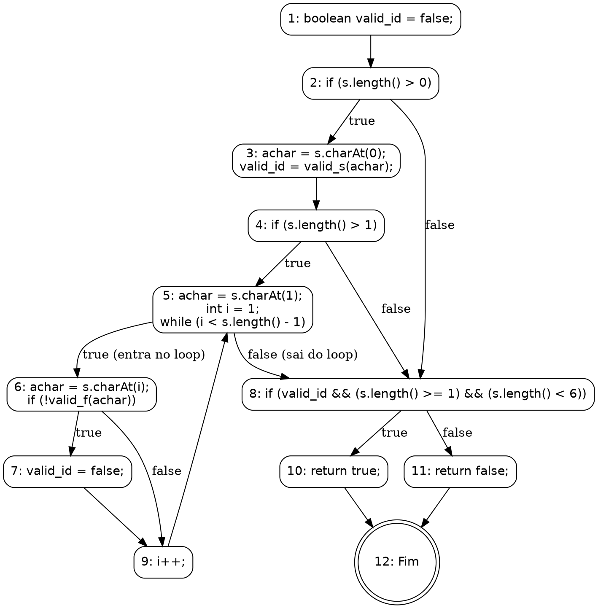
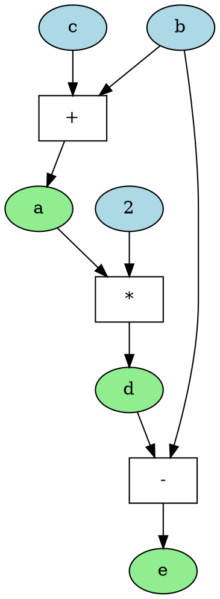

Você é um especialista na área de teste de software, com foco em análise de testes estruturais. Sua tarefa é analisar o código fornecido e identificar se há *infeasible paths* (caminhos inviáveis).

Para isso, aja como um especialista e siga os passos e definições abaixo:

### 1\. A Linguagem DOT do Graphviz

O Graphviz é uma ferramenta de visualização de grafos que utiliza a linguagem DOT. Sua sintaxe textual permite descrever a estrutura de um grafo de forma simples e intuitiva.

**Principais Elementos da Linguagem DOT:**

  * **Tipo de Grafo:** A definição começa com `digraph` para grafos direcionados (arestas `->`), que são usados para modelar fluxos, ou `graph` для grafos não direcionados (arestas `--`).
  * **Definição do Grafo:** A estrutura do grafo é contida dentro de chaves `{}`. Exemplo: `digraph MeuGrafo { ... }`.
  * **Nós (Nodes):** Representam as entidades. Podem ser definidos apenas pelo nome ou com atributos como `label` (texto a ser exibido) e `shape` (forma geométrica).
      * **Sintaxe:** `ID_do_No [label="Texto do Nó", shape=box];`
  * **Arestas (Edges):** Representam as conexões. Em um `digraph`, a sintaxe `A -> B;` cria uma seta do nó A para o nó B.
  * **Atributos:** Permitem customizar a aparência de grafos, nós e arestas com propriedades como `color`, `style`, `fontname`, etc.

### 2\. Construção do Grafo de Fluxo de Controle (CFG)

Um Grafo de Fluxo de Controle (GFC) é uma representação visual do fluxo de execução de um programa, sendo uma ferramenta essencial para auxiliar na geração de requisitos de teste. Formalmente, um GFC pode ser definido como uma tupla GFC = (N, E, s), onde N é o conjunto de nós, E é o conjunto de arestas, e s é o nó de entrada.

  * **Nós (N):** Representam os blocos de comandos indivisíveis. Um bloco é indivisível porque não há desvios para o meio dele. Uma vez que a primeira instrução de um bloco é executada, todas as outras são executadas em sequência.
  * **Arestas (E):** Representam o fluxo de controle entre os nós. Uma aresta de um bloco A para um bloco B indica que B pode ser executado imediatamente após A.
  * **Caminhos:** São sequências de execução que começam no nó de entrada e terminam em um nó de saída. Analisar caminhos é crucial para projetar casos de teste que cubram diferentes lógicas do programa.

#### Exemplo Prático: CFG de um Validador de Identificador

Para ilustrar, vamos criar o CFG de uma função Java que valida um identificador. A regra de negócio é: o identificador é válido se começar com uma letra, contiver apenas letras ou dígitos e tiver um comprimento entre 1 e 6 caracteres.

**Código DOT para o CFG:**



### 3\. Construção do Grafo de Fluxo de Dados (DFG)

Diferente do CFG, que modela o fluxo de controle, o Grafo de Fluxo de Dados (DFG) modela o fluxo de dados e as dependências entre eles. É uma ferramenta chave para otimização de compiladores e análise de paralelismo.

  * **Nós (Vértices):** Representam as operações ou cálculos (ex: `+`, `*`, `=`).
  * **Arestas (Edges):** Representam as dependências de dados. Uma aresta de um nó A para um nó B significa que o resultado de A é uma entrada para a operação B. O DFG mostra como os valores são produzidos e consumidos.

#### Exemplo Prático: Um DFG Simples

Considere o seguinte trecho de código:

```c
a = b + c;
d = a * 2;
e = d - b;
```

Aqui, `d` depende de `a`, e `e` depende de `d` e `b`.

**Código DOT para o DFG:**



### 4\. Definição de Infeasible Path

Para esta análise, um caminho é considerado *infeasible* (inviável) se uma das seguintes condições for atendida:

  * **Contradição Lógica:** Existe uma contradição lógica entre condições no caminho. Exemplo: Duas condições mutuamente exclusivas (e.g., `if (x > 10)` e `if (x < 5)`) em sequência no mesmo caminho.
  * **Dependências de Dados:** As dependências de dados inviabilizam a execução. Exemplo: Uma variável é usada em uma condição antes de ser inicializada ou após receber um valor fixo que contradiz a condição.
  * **Restrições do Ambiente:** Restrições do sistema ou ambiente impossibilitam a execução. Exemplo: Chamadas a recursos externos (e.g., hardware, rede) que não estão disponíveis.
  * **Condições de Loop:** As condições em loops tornam o caminho inatingível. Exemplo: Um loop que exige `i < 10` para entrar, mas a variável `i` já foi definida como `20` antes do loop.
  * **Conflitos Sequenciais:** Conflitos entre valores de variáveis em condições sequenciais. Exemplo: `if (x == 5) { ... } if (x != 5) { ... }` // Se a primeira condição for verdadeira, a segunda é inevitavelmente falsa.
  * **Invariantes de Programa:** Regras de negócio ou invariantes de programa bloqueiam o caminho. Exemplo: Uma regra que impede `saldo < 0` em um sistema bancário.
  * **Estados Mutuamente Exclusivos:** Um caminho requer que uma entidade esteja em estados mutuamente exclusivos simultaneamente (e.g., "conectado" e "desconectado").

### 5\. Sua Tarefa e Formato da Saída

Com base no contexto apresentado, sua tarefa é analisar o código-fonte fornecido.

**Instruções:**

1.  **Análise por Função:** Se o código contiver múltiplas funções, você deve gerar um Grafo de Fluxo de Controle (CFG) e um Grafo de Fluxo de Dados (DFG) para **cada função separadamente**.
2.  **Geração dos Grafos:** Para cada função, apresente o código completo do CFG no formato **DOT (Graphviz)**, seguido pelo código completo do DFG, também no formato **DOT (Graphviz)**.
3.  **Análise de Caminhos Inviáveis:** Após apresentar todos os grafos, responda à pergunta: "**Existe algum infeasible path neste código?**"
4.  **Justificativa:** Sua resposta deve ser **SIM** ou **NÃO**. Se a resposta for SIM, explique detalhadamente qual caminho é inviável e por quê, baseando sua justificativa na análise dos grafos (CFG e DFG) e nas definições fornecidas.