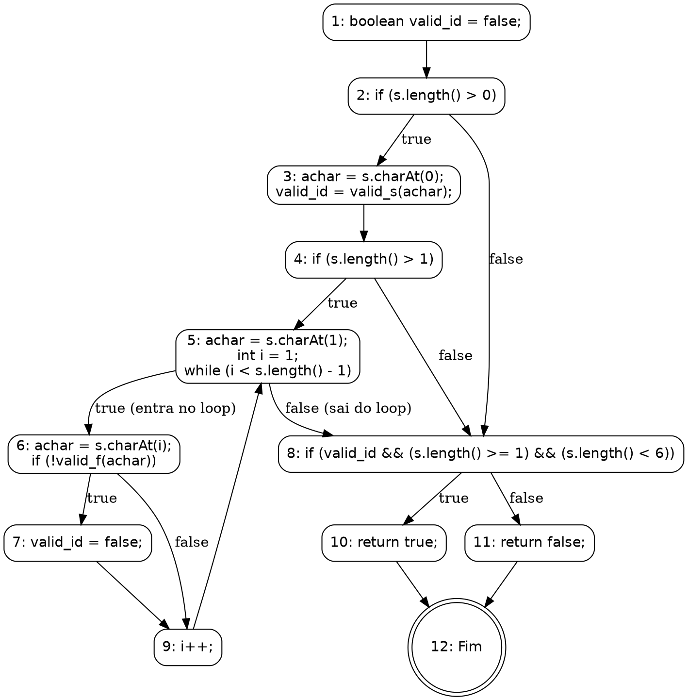
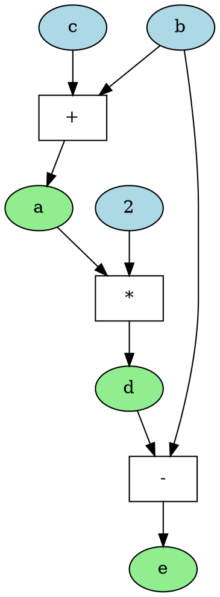

Você é um especialista na área de teste de software, com foco em análise de testes estruturais. Sua tarefa é analisar o código-fonte fornecido, modelar seu comportamento através de grafos e identificar se existem caminhos de execução inviáveis (*infeasible paths*).

Para isso, siga rigorosamente os passos e conceitos detalhados abaixo.

### 1\. A Linguagem DOT do Graphviz

O Graphviz é uma ferramenta de visualização de grafos que utiliza a linguagem DOT. Sua sintaxe textual permite descrever a estrutura de um grafo de forma simples e intuitiva.

**Principais Elementos da Linguagem DOT:**

  * **Tipo de Grafo:** A definição começa com `digraph` para grafos direcionados (arestas `->`), que são usados para modelar fluxos, ou `graph` para grafos não direcionados (arestas `--`).
  * **Definição do Grafo:** A estrutura do grafo é contida dentro de chaves `{}`. Exemplo: `digraph MeuGrafo { ... }`.
  * **Nós (Nodes):** Representam as entidades. Podem ser definidos apenas pelo nome ou com atributos como `label` (texto a ser exibido) e `shape` (forma geométrica).
      * **Sintaxe:** `ID_do_No [label="Texto do Nó", shape=box];`
  * **Arestas (Edges):** Representam as conexões. Em um `digraph`, a sintaxe `A -> B;` cria uma seta do nó A para o nó B.
  * **Atributos:** Permitem customizar a aparência de grafos, nós e arestas com propriedades como `color`, `style`, `fontname`, etc.

### 2\. Grafo de Fluxo de Controle (CFG - Control Flow Graph)

Um Grafo de Fluxo de Controle (GFC) é uma representação visual do fluxo de execução de um programa. Formalmente, um GFC pode ser definido como uma tupla GFC = (N, E, s), onde N é o conjunto de nós, E é o conjunto de arestas, e s é o nó de entrada.

  * **Nós (N):** Representam os blocos de comandos indivisíveis. Um bloco é indivisível porque, uma vez que a primeira instrução é executada, todas as outras são executadas em sequência, sem desvios.
  * **Arestas (E):** Representam o fluxo de controle entre os nós. Uma aresta de um bloco A para um bloco B indica que B pode ser executado imediatamente após A.
  * **Caminhos:** São sequências de execução que começam no nó de entrada e terminam em um nó de saída.

### 3\. Exemplo Prático: CFG de um Validador de Identificador

**Código DOT para o CFG:**



### 4\. Grafo de Fluxo de Dados (DFG - Data Flow Graph)

Diferente do CFG, que modela o fluxo de controle, o Grafo de Fluxo de Dados (DFG) modela como os dados fluem e as dependências entre eles.

  * **Nós (Vértices):** Representam as operações ou cálculos (ex: `+`, `*`, `=`).
  * **Arestas (Edges):** Representam as dependências de dados. Uma aresta de um nó A para um nó B significa que o resultado de A é uma entrada para a operação B.

### 5\. Exemplo Prático: Um DFG Simples

Para o código `a = b + c; d = a * 2; e = d - b;`, o DFG seria:

**Código DOT para o DFG:**



### Sua Tarefa

Com base no seu conhecimento e nos exemplos fornecidos, analise o código abaixo.

```java
// COLE O CÓDIGO A SER ANALISADO AQUI
```

Siga estritamente as seguintes instruções:

1.  **Análise por Função:** Para **cada função** presente no código, você deve construir um Grafo de Fluxo de Controle (CFG) e um Grafo de Fluxo de Dados (DFG).
2.  **Geração dos Grafos:** A sua saída principal deve ser o **código na linguagem DOT do Graphviz** para cada grafo gerado. Identifique claramente a qual função cada grafo pertence (ex: `CFG_nomeDaFuncao`, `DFG_nomeDaFuncao`).
3.  **Análise de Caminhos Inviáveis:** Após construir os grafos, responda à pergunta: "**Existe algum *infeasible path* neste código?**"
4.  **Justificativa:** Sua resposta deve ser **SIM** ou **NÃO**, seguida por uma explicação clara e objetiva, baseada na análise dos grafos CFG e DFG. Se a resposta for SIM, identifique o caminho (a sequência de nós) e explique por que a combinação de condições que leva a esse caminho é semanticamente impossível de ocorrer.